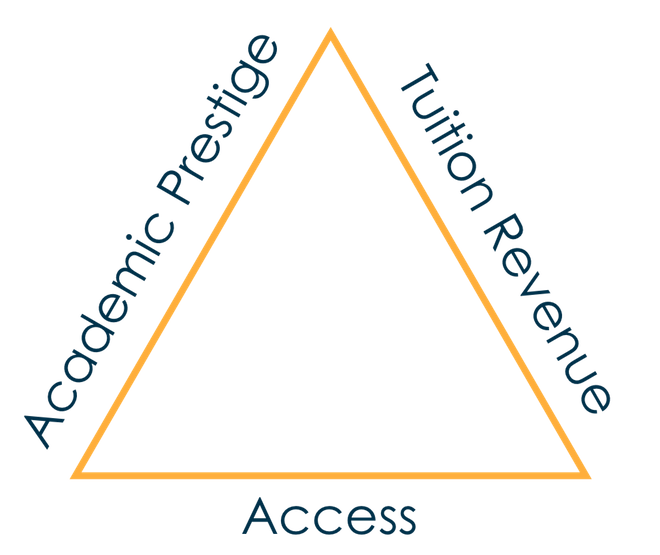
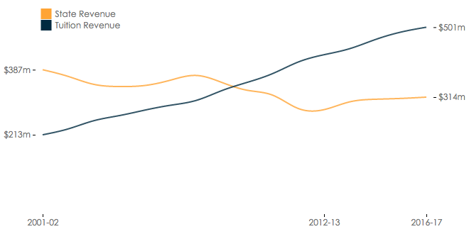

```{r setup, include=FALSE}

library(dplyr)
library(captioner)

fig_nums <- captioner::captioner(prefix = 'Figure')

fig_nums(name = 'iron_triangle', caption = 'Iron triangle of enrollment management')
fig_nums(name = 'revenue_graph', caption = 'Average state and tuition revenue of public research-extensive universities, 2001-02 through 2016-17')
fig_nums(name = 'enrollment_funnel.png', caption = 'Enrollment management funnel')
fig_nums(name = 'income_graph', caption = 'Average median household income of visited vs. non-visited public high schools')
fig_nums(name = 'income_map', caption = 'Visits to metro areas by median household income')
fig_nums(name = 'race_graph', caption = 'Average racial composition of visited vs. non-visited high schools by in-state, out-of-state')
fig_nums(name = 'race_map', caption = 'Visits to metro areas by percent black, Latinx, and Native American')

tbl_nums <- captioner::captioner(prefix = 'Table')

tbl_nums(name = 'hsls_tbl1', caption = 'Number of high-achieving students by socioeconomic quintile')
tbl_nums(name = 'hsls_tbl2', caption = 'Initial post-secondary destination of high-achieving students by socioeconomic quintile')
tbl_nums(name = 'event_count', caption = 'State funding and number of events by type, in-state vs. out-of-state')

apndx_nums <- captioner::captioner(prefix = 'Appendix Table A', suffix = ': ', auto_space = FALSE)

apndx_nums(name = 'data_quality', caption = 'Summary of data collection sources and quality checks performed')

```


<section class="Content">


<!--
[DEVELOP SNAPPIER LEDE; MAYBE AROUND ADMISSIONS SCANDAL?]
-->

Historically, the mission of public research universities has been to provide opportunity and social mobility for state residents who cannot afford tuition at elite private colleges and universities. Yet today these institutions are increasingly unrepresentative of the socioeconomic and racial diversity of the states they serve---in large part because they enroll a large and growing share of affluent out-of-state students.

Policy debates often attribute this access inequality to the academic achievement gap between low-income and affluent students.[@RN4016] However, `r tbl_nums('hsls_tbl1', display='cite')` below shows that there is actually an abundance of students from lower socioeconomic quintiles who are well-qualified for admission into competitive universities. Yet unfortunately, `r tbl_nums('hsls_tbl2', display='cite')` shows that these high-achieving, low-income students are much more likely than their affluent peers to attend community college instead. Policymakers refer to this phenomenon as "under-matching"---the idea that high-achieving, low-income students do not apply to selective institutions because they lack the proper information and guidance from their family and high school.[@RN3699] But a recent experimental evaluation by the College Board found that interventions providing these students with more information about their college options and the application process showed no effect on their enrollment in selective institutions, suggesting that student behavior and inadequate transparency around options may not be the only reason for access inequality.[@RN4468]

An alternative explanation is that the enrollment priorities of public research universities may be biased against low-income students and/or students of color. If so, fixing student achievement and college application decisions will ultimately fail to overcome the access inequality. Most college access policies focus on changing student behavior because policymakers typically know little about university enrollment priorities and therefore treat universities as passive recipients of applications. In reality, however, universities are extremely purposeful about which students they enroll and spend substantial resources identifying and pursuing desired prospects, which is why we make the case that knowing which student populations are targeted by university recruiting efforts is a credible indicator of their enrollment priorities. 

This report analyzes university recruiting behavior in order to assess the extent to which university enrollment priorities contribute to access inequality. We begin by providing background information about the enrollment management industry and how universities go about recruiting desired prospects. Next, we present results from a study highlighting how most public research universities make far more out-of-state visits than in-state visits and that these out-of-state visits focus on affluent, predominantly white high schools. Finally, we discuss the policy implications of these findings, emphasizing the relationship between public funding for higher education and the enrollment priorities of public universities. Reports showing that universities stack the deck for rich kids are a dime a dozen. We explain why universities behave this way and we begin a discussion about what can be done to change it.

<!--
Revitalizing the social mobility mission of public flagship universities is essential because these institutions are designated the unique responsibility of transforming raw talent into the future civic, professional, and business leaders of the state. When public research universities systematically ignore high-achieving, low-income state residents, these students are often funneled into community colleges. Research resoundingly finds that this has a dramatic negative effect on the probability of obtaining a bachelor's degree,[@RN4284; @RN2261; @RN4292; @RN4405] with the most recent analyses finding that starting at a community college rather than a 4-year university reduces the probability of attaining a BA by 18 percentage points, from a 50\% probability to 32\% probability.[@RN4469]
-->


###### `r tbl_nums('hsls_tbl1')`

<iframe src="./assets/tables/hsls_tbl1.html" width="955" height="180" class="tableau offset"></iframe>

###### `r tbl_nums('hsls_tbl2')`

<iframe src="./assets/tables/hsls_tbl2.html" width="955" height="240" class="tableau offset"></iframe>


## Background

#### Enrollment Management by Public Research Universities

While policy debates about access to higher education often focus on student behavior, universities are purposeful about which students they pursue and expend substantial resources on crafting their incoming class. Understanding the relationship between university enrollment behaviors and access inequality requires a basic understanding of the enrollment management industry. 

Specifically, enrollment management (EM) is a profession that integrates techniques from marketing and economics in order to "influence the characteristics and the size of enrolled student bodies."[@RN2771] EM is also a common university administrative structure, and many institutions have an Office of Enrollment Management that coordinates the activities of the teams responsible for admission, financial aid, marketing, and recruiting. 

<!--
STUFF NOT CURRENTLY IN POLICY IMPLICATIONS

The broader enrollment management industry consists of professionals working within universities (e.g., admissions counselors), the associations enrollment management professionals belong to (e.g., National Association for College Admission Counseling), and the marketing/enrollment management consultancies universities hire (e.g., Hobsons, Ruffalo Noel Levitz).
-->

###### `r fig_nums('iron_triangle')`


`r fig_nums('iron_triangle', display='cite')` displays the "iron triangle" of enrollment management, which depicts the maxim that universities care about three broad enrollment goals: access, academic prestige, and tuition revenue. For public universities, the "access" goal refers to access for state residents and access for underserved student populations, such as first-generation, underrepresented students of color. Across sectors, "academic prestige" often refers in practice to the annual _U.S. News and World Report_ college rankings. Because resources are scarce, the imagery of the iron triangle suggests that pursuing one goal involves trade-offs with the others. Growing preoccupation with rankings incentivizes universities to prioritize the academic prestige goal, while state disinvestment incentivizes universities to prioritize the   tuition revenue goal and discourages universities from enrolling large numbers of low-income students. Consistent with this idea, average state funding at the 63 public research-extensive universities as defined by the 2005 Carnegie Classification declined from \$387 million in 2001-02 to \$280 million in 2012-13, recovering only to \$314 million by 2016-17 despite several years of economic growth.[@NOTE1] By contrast, average net tuition revenue at these institutions increased from \$213 million in 2001-02 to \$501 million in 2016-17.

###### `r fig_nums('revenue_graph')`


<!--
cd "${drop}nonres-oj-bc${a}effect-on-personnel${a}data"
use nonres-personnel-analysis-data.dta, clear

	****DESCRIPTIVES FOR THIRD WAY REPORT

		table endyear if endyear>=2002 & endyear<2018 & sector==1 & inlist(cc2005,15)==1 & inlist(unitid,190576,110699)==0, ///
			contents(freq count statea count tuition mean statea mean tuition) cellw(20) format(%12.0fc)

------------------------------------------------------------------------------------------------------------------------
academic  |
year,     |
e.g.      |
1995=1994 |
-95       |                Freq.             N(statea)            N(tuition)          mean(statea)         mean(tuition)
----------+-------------------------------------------------------------------------------------------------------------
     2002 |                   63                    63                    57           387,122,306           212,706,325
     2003 |                   63                    63                    62           369,153,025           228,521,367
     2004 |                   63                    63                    63           347,918,359           250,437,175
     2005 |                   63                    63                    63           342,027,079           264,202,593
     2006 |                   63                    63                    63           344,903,602           278,913,696
     2007 |                   63                    63                    63           359,182,358           291,902,195
     2008 |                   63                    63                    63           371,787,272           304,787,780
     2009 |                   63                    63                    63           353,161,591           331,012,604
     2010 |                   63                    63                    63           332,042,020           353,311,528
     2011 |                   63                    63                    63           318,664,537           377,031,563
     2012 |                   63                    63                    63           282,977,959           407,994,588
     2013 |                   63                    63                    63           280,118,438           427,348,666
     2014 |                   63                    63                    63           300,906,269           443,499,379
     2015 |                   63                    63                    63           307,975,644           467,870,679
     2016 |                   63                    63                    63           310,162,089           487,915,230
     2017 |                   63                    63                    63           313,662,710           501,088,909
------------------------------------------------------------------------------------------------------------------------

select endyear, count(*), count(statea), count(tuition), avg(statea), avg(tuition)
from carnegie_classification cc
left join meta_univ_data mud on mud.unitid = cc.univ_id
where control = '1'  -- public institutions
and classification_2005 = '15'  -- highest ranking
and school_type != '6'  -- excludes a grad school
and endyear between '2002' and '2017'
group by endyear
;
-->

#### Creating the Out-of-State University

<!--
[IF THIS SUB-SECITON ON OUT-OF-STATE ENROLLMENT GROWTH IS GETTING TOO LONG AND DISRUPTS FLOW BETWEEN PREVIOUS AND SUBSEQUENT SUB-SECTION THEN WE CAN CUT IT DOESN OR MOVE IT. YOUR CALL]
-->

Public research universities have responded to these declining state appropriations by dramatically increasing nonresident enrollment, which they’ve done for one simple and economically rational reason: out-of-state students often pay two- to three-times more than residents. In fact, empirical research has shown that a 10% decline in state appropriations was associated with a 4.6% increase in nonresident freshman enrollment.[@RN3753]  Between 2001-02 and 2016-17, average nonresident freshman enrollment at the nation's 63 public research-extensive universities increased from about 800 (19% of the freshman class) to over 1,400 (26% of the freshman class).[@NOTE2]

Nationally prestigious public research universities, such as the University of Michigan and the University of California, Los Angeles (UCLA), enjoy strong demand from high-achieving out-of-state students. However, most public research universities do not have strong national name recognition and compete for out-of-state students who were rejected by flagship universities in their own state. For example, the University of Arizona may pursue Californians denied by the University of California system and the University of Arkansas may pursue Texans denied by the University of Texas-Austin and Texas A&M. As competition for out-of-state (and international) students increases, less-prestigious public flagship universities have also adopted institutional "merit aid" programs that are often specifically designed to target out-of-state students with mediocre academic achievement.[@RN4409; @RN4032; @RN3519; @RN3762; @RN4494]

In response to these trends, legislators in several states including California have proposed nonresident enrollment caps based on the premise that nonresident students "crowd out" access for residents. University administrators counter that amidst state budget cuts, nonresident tuition revenue enables universities to finance (1) resident access and (2) faculty employment necessary to educate students. Our study assessed these claims empirically and we found that nonresident enrollment has no effect on resident enrollment for public research universities as a whole and has a negative effect on resident enrollment at nationally prestigious universities.[@RN4290] Additionally, our research showed that nonresident enrollment has a strong positive relationship with faculty hiring.[@RN4492] We found that enrolling 100 additional nonresident freshmen is associated with hiring 1.42 new tenure-line faculty, while enrolling 100 additional resident freshmen is associated with hiring 0.64 tenure-line faculty. Most notably, however, we found that nonresident enrollment growth affects student composition in undesirable ways. Since nonresident students tended to be more affluent and were less likely to be black or Latinx than resident students, growth in the share of nonresident students was associated with declines in the share of low-income students receiving federal need-based Pell Grants and black or Latinx students at public research universities.[@RN3685]


#### The Enrollment Funnel

`r fig_nums('enrollment_funnel.png', display='cite')` depicts the enrollment funnel, a conceptual tool used by the EM industry to describe stages in the student recruitment process that inform targeted recruiting interventions. The vast majority of research on enrollment management focuses on the final stages of the enrollment funnel, specifically which applicants are admitted[@RN3536; @RN3544; @RN3523; @RN4131] and the use of financial aid "leveraging" to convert admits to enrollees.[@RN2241; @RN3564; @RN1948] By contrast, the enrollment management industry expends substantial resources on _earlier_ stages in the funnel, including on "prospects" who represent "all the potential students you would want to attract to your institution,"[@RN4322] and "inquiries," or the prospects that contact the university, including those who respond to university solicitations like emails and brochures and those who reach out on their own by taking actions such as sending SAT/ACT scores to a university or completing a form on the admissions website.

###### `r fig_nums('enrollment_funnel.png')`


```{r, eval=FALSE, include=FALSE}

`r fig_nums('funnel', display='cite')` 

\addFigure{funnel_alt.png}{The Enrollment Funnel.}{emfunnel}{0}{0}{0}{0.2}{t}

Figure~\ref{fig:emfunnel} depicts the ``enrollment funnel,'' a conceptual tool the EM industry uses to describe stages in student recruitment in order to inform targeted recruiting interventions.  While scholarship and policy debate about college access focuses on the final stages of the enrollment funnel -- when applicants are admitted \citep[e.g., ][]{RN3536} and financial aid ``leveraging'' is used to convert admits to enrollees \citep[e.g., ][]{RN1948} -- the EM industry expends substantial resources on earlier stages of the funnel.  ``Prospects'' are ``all the potential students you would want to attract to your institution'' \citep{RN4322}. ``Inquiries'' are prospects that contact the university. These include inquiries who respond to initial solicitation by the universities (e.g., email, brochure) and unsolicited inquiries who reach out on their own (e.g., sending SAT/ACT scores to the university, completing a form on the university admissions website).  Most universities hire EM consulting firms, which utilize sophisticated, data-intensive methodologies, to help universities identify prospects, solicit inquiries, convert prospects and inquiries into applicants, etc. For example, from 2010 to 2018 the University of Alabama paid \$4.4 million to the EM consulting firm Hobsons \citep{RN4035} (2018 CPI).
```

Universities identify prospects primarily by purchasing student lists from the College Board and ACT, Inc., which own large databases on prospective college students. Student lists contain contact details and background information (demographic, socioeconomic, and academic) about individual prospects. Universities control which prospects are included in the list by selecting on criteria such as zip code, race, and academic achievement. Ruffalo Noel Levitz, an enrollment management consulting firm, found that the median public university purchases about 64,000 names.[@RN4314] And these names don't come cheap: the median public university spent 14% of its marketing and recruiting budget on student list purchases.[@RN4402] To provide a concrete example, from 2010 to 2018, the University of Alabama paid \$1.9 million to College Board and \$349,000 to ACT, Inc. for student data.[@RN4035]

Once identified, prospects are then targeted with recruiting interventions aimed at soliciting inquiries and applications.[@RN4323; @RN4402] Face-to-face interventions include off-campus visits by university admissions representatives---for example, to a local high school---and on-campus visits by prospects. Non-face-to-face interventions include text messages, emails, and physical mail, such as postcards and brochures. Additionally, universities use paid advertising, including pay-per-click ads from Google and cookie-driven ads that target prospects who visit their website, as well as social media, such as Twitter, Instagram, and YouTube, as a means of generating inquiries and creating positive "buzz" amongst prospects. Given the rise in "stealth applicants" who do not inquire before applying,[@RN4411] social media enables universities to tell their story to prospects who do not contact the university and may not wish to be contacted.

The data science revolution in market research has given birth to a niche industry of higher education enrollment management and enrollment marketing consulting firms. These firms help universities identify prospects, such as advising on which criteria to select when purchasing student lists and pinpointing which prospects should receive which recruiting interventions---another practice that comes at a high price tag for institutions. Going back to the University of Alabama, from 2010 to 2018 the university paid \$4.4 million to the EM consulting firm Hobsons (2018 CPI).[@RN4035] Consultancies like Hobsons integrate proprietary data, publicly-available data, and university-owned data, such as historical data on applicants and IP addresses that visit the university website. As an example of proprietary data, one enrollment management consultancy told us they know the household income, house value, and detailed expenditures of every household in the United States, down to things like the annual expenditures on hockey equipment. Firms then make recommendations by applying these data sources to analytic tools that predict application and enrollment probabilities for each prospect and also predict the effect of recruiting interventions on these probabilities.

```{r, eval=FALSE, include=FALSE}


Universities hire these firms to make recommendations about how to identify prospects (e.g., search criteria for student list purchases) and about which prospects should receive which recruiting interventions.
Following the "data science" revolution in market research, 

In higher education, the most common application of data-science is marketing.  Search engines used by prospective students (e.g., Parchment, Niche) sell data on “prospects” to for-profit enrollment management firms (e.g., Hobsons, Chegg) that integrate multiple data sources (e.g., test scores, geographic location) to help universities identify and recruit desirable prospects.  

Enrollment management firms (e.g., Hobsons) offer market segmentation software to help colleges identify desirable prospects.  
Universities increasingly pay marketing firms for software that uses data-science methods to identify and recruit prospects.

Additionally, free college search engines (e.g., Niche, Parchment) sell data entered
by prospective students to “data science” marketing firms (e.g., Chegg, Hobsons). Universities hire
these marketing firms to identify prospects and to decide which prospects should be targeted with
which interventions, based on analytic tools that predict application and enrollment probabilities
for each prospect.

, which utilize sophisticated, data-intensive methodologies, to help universities identify prospects, solicit inquiries, convert prospects and inquiries into applicants, etc. 

```


#### Off-Campus Recruiting

It's important to also note that the growing sophistication of off-campus student recruiting does not stop behind the curtain of online and data-driven marketing research, but instead extends into the world of off-campus visits. In the admissions world, "travel season" refers to the mad dash between Labor Day and Thanksgiving when admissions officers host hotel receptions, college fairs, and visit high schools across the country.[@RN3519] Ruffalo Noel Levitz found that public universities spent 18% of their marketing and recruiting budget on these off-campus techniques, compared to 15% for on-campus visits and 14% for student list purchases.[@RN4402; @NOTE3] 

Enrollment managers value off-campus recruiting as a means of simultaneously identifying prospects and connecting with prospects already being targeted through mail and email.[@RN4323; @RN4315; @RN3519] Further, these visits are essential for maintaining long-term relationships with "feeder schools"---and the guidance counselors at these schools---that are a consistent source of students year after year.[@RN3519; @RN4402] Prior research finds that admissions recruiters prioritize affluent high schools, with a particular focus on private schools, that have the organizational resources and motivation to host successful visits.[@RN3519]

Market research on the effect of off-campus recruiting finds that off-campus visits were the second highest source of inquiries after student list purchases, accounting for 19\% of inquiries for the median public university.[@RN4402]  Off-campus visits were also the third highest source of enrollees behind stealth applicants and on-campus visits, accounting for 16\% of enrollees.  Qualitative research from the perspective of high school students similarly found that high school visits influenced where students applied and where they enrolled.[@RN4324] These findings were particularly strong for first-generation students. By contrast, affluent students with college-educated parents tended to be less taken by targeted overtures from universities and more concerned about university prestige.


While prior research finds that off-campus recruiting influences the application and enrollment decisions of underrepresented students and accounts for a larger share of university marketing and recruiting budgets, our research is the first to systematically investigate which high schools receive visits by which universities and why this matters to broader inequities across our higher education system.


<!--
CUT TEXT

, who analyzed recruiting from the perspective of high school students, found that high school visits influenced where students applied and where they enrolled, particularly first-generation students.  Finally, echoing findings from market research [@RN4402], @RN3519 found that high school visits were instrumental for maintaining strong relationships with guidance counselors at "feeder schools." These relationships were essential because "the College's reputation and the quality of its applicant pool are dependent upon its connections with high schools nationwide" [@RN3519, p. 53].

-->


## Research and Findings

In the text below, we present findings from our research, which collected data on off-campus recruiting visits by public research universities. The project goal was to assess socioeconomic, racial, and geographic biases in which schools and communities receive visits. The results presented here analyze off-campus recruiting visits during the 2017 calendar year by a selection of 15 public research universities. These universities came from a sample of public research-extensive universities as defined by the 2000 Carnegie Classification and were institutions from which we collected sufficient data.[@NOTE4]

#### Follow the Money

`r tbl_nums('event_count', display='cite')` shows the number of recruiting visits by event type, such as public high school or private high school, and whether the visit was in-state or out-of-state for the 15 public research universities in our sample. Across all of the universities, the majority of visits were to public high schools. However, our most dramatic finding is that most universities made more out-of-state than in-state visits---a principle that runs counter to the stated missions of large, state-based university systems. Seven universities made _more than twice_ as many out-of-state than in-state visits. And, when compared to in-state visits, a disproportionate number of these out-of-state visits were to private high schools.[@NOTE5] 

In addition, we find that recruiting patterns are often tied to state funding, with universities that had the lowest state funding turning to out-of-state recruiting efforts as a way to generate greater revenue from tuition. As seen in `r tbl_nums('event_count', display='cite')`, the University of Alabama, which has experienced state disinvestment from higher education, made significantly more out-of-state visits than in-state visits. On the other hand, universities that received more state funding tended to have more complete coverage of their home state. For example, North Carolina State University made about twice as many in-state visits than out-of-state visits. Several universities in our sample also made a substantial number of visits to community colleges in their state. 


###### `r tbl_nums('event_count')`

<iframe src="./assets/tables/event_count.html" width="955" height="500" class="tableau offset"></iframe>


##### Trends in Median Income of Visited High Schools

`r fig_nums('income_graph', display='cite')` shows the average median household income in zip codes of visited public high schools compared to non-visited public high schools for in-state and out-of-state visits. We see that out-of-state visits are heavily focused on affluent communities across all the universities in our sample. For example, the University of Massachusetts-Amherst visited out-of-state public high schools in zip codes where the average median household income was \$115,000 while the average income for non-visited schools was \$64,000, resulting in a \$51,000 gap. The average income disparity between visited and non-visited out-of-state public high schools across all institutions in our sample is around \$40,000, suggesting that universities prioritize recruiting students from wealthier communities. In fact, we find that affluent out-of-state schools are significantly more likely to receive a visit even after using regression models that control for factors such as academic achievement and school size.[@NOTE6]

###### `r fig_nums('income_graph')`

<div style="height:950px">
  <iframe src="./assets/graphs/third_way_income.html" width="955" height="950" class="tableau offset" style="width:680px;float:right;"></iframe>
</div>


To hone in even further on how public institutions target their out-of-state recruitment efforts on more affluent students, `r fig_nums('income_map', display='cite')` shows an illustrative example of the University of Pittsburgh’s efforts to recruit students in the Chicago metropolitan area---a prime target for recruiting students given its close geographic proximity. The map shows the visited and non-visited public high schools by the University of Pittsburgh, with each zip code in the Chicago metropolitan area shaded according to median household income. The blue circle markers indicate the location of a public high school, and filled circle markers indicate that the high school is visited by the University of Pittsburgh. As you can see, visited schools are largely concentrated in the more affluent communities located in the northeastern region of the metropolitan area, while schools near the outer edges of the metro area with lower median household incomes are far less likely to receive a visit.


###### `r fig_nums('income_map')`

<iframe src="./assets/maps/map_income.html" width="955" height="700" class="tableau offset"></iframe>

<p style="color: gray;font-style: italic;">\* An interactive version of the map is available by following the link below. Readers are encouraged to explore the recruiting visits of other universities in our sample by selecting different universities and metro areas. The controls near the bottom left of the map toggle the display of visited and non-visited locations. Each circle marker indicates a location and filled circle markers indicate that the location has been visited by the selected university.</p>

Income bias in in-state public high school visits also exists across the majority of the institutions in our sample, but to a lesser extent. For example, the difference in average median household income between visited and non-visited in-state public high schools by the University of California-Berkeley is \$19,000. The average income disparity across all institutions is around \$11,000. It should also be noted that two of the institutions, the University of California-Irvine and North Carolina State University, actually visited public high schools in their home state with a _lower_ average income than schools not visited.


##### Trends in Racial Composition of Visited High Schools

`r fig_nums('race_graph', display='cite')` shows the average racial compositions of visited high schools compared to non-visited high schools for in-state and out-of-state visits by the institutions in our sample. Similar to the income results, out-of-state visits to public high schools show the most evidence of racial bias. A majority of the institutions in our sample visited out-of-state public high schools with an overall higher share of white students and lower share of black, Latinx, and Native American students. For example, the University of Colorado-Boulder visited out-of-state public high schools where white students make up 56% of the combined total, as compared to 49% in non-visited high schools. At the same time, black, Latinx, and Native American students make up 7%, 20%, and less than 0.5% of visited public high school students, respectively, compared to 16%, 27%, and close to 1% of non-visited students. For most of the institutions in our sample, regression results show that the racial bias in out-of-state public high school visits persists even after controlling for other school characteristics.


###### `r fig_nums('race_graph')`

<div style="height:1050px">
  <iframe src="./assets/graphs/third_way_race.html" width="955" height="1050" class="tableau offset" style="width:800px;float:right;"></iframe>
</div>


`r fig_nums('race_map', display='cite')` again shows a map of visited and non-visited public high schools by the University of Pittsburgh in the Chicago metropolitan area. Each zip code is shaded according to the proportion of residents who identify as black, Latinx, or Native American. The majority of visited high schools are concentrated in the northern part of the metro area, where there is a low proportion of black, Latinx, and Native American students. Communities of color are located primarily near the southeastern part of the region, and these public high schools received very few visits. 


###### `r fig_nums('race_map')`

<iframe src="./assets/maps/map_race.html" width="955" height="700" class="tableau offset"></iframe>


When looking at out-of-state visits to private high schools, `r fig_nums('race_graph', display='cite')` shows that the racial composition of students remain relatively consistent between visited and non-visited schools. However, private high schools in general have a higher percentage of white students than public high schools, and universities tend to visit a disproportionate number of out-of-state private high schools. Therefore, the overall population of out-of-state students visited by the universities in our sample tended to be more white. 

In-state visits, on the other hand, show inconsistent evidence of racial bias across our sample institutions. For example, the University of Alabama visited in-state schools with a larger percentage of white students and a smaller percentage of black, Latinx, and Native American students as compared to non-visited schools in the state, whereas the University of California-Irvine visited in-state schools with a higher proportion of students of color than non-visited schools. Nevertheless, in comparison to out-of-state visits to public high schools, the difference in average racial composition between visited and non-visited students remains relatively small across all cases.


## Policy Implications

<!--
STUFF NOT CURRENTLY IN POLICY IMPLICATIONS

- degree completion is largely a function of access
- innovative research on access rather than degree completion?

Mainstream policy debates highlight the "achievement gap" and "under-matching" -- high-achieving students who do not apply to selective colleges -- as causes of racial and socioeconomic inequality in college access. These explanations point to deficiencies of students and K-12 schools, motivating policy interventions that attempt to "fix" students, while absolving institutions of their responsibility to provide equal access
-->

Mainstream policy debates about socioeconomic and racial inequality in college access often point to deficiencies of students and K-12 schools, citing the "achievement gap" and "under-matching" (the idea that high-achieving, low-income students do not apply to selective institutions because they lack the proper information and guidance from their family and high school). These explanations motivate policy interventions that attempt to "fix" students, absolving universities of their responsibility to provide equal access. If university enrollment priorities are biased, then improving student achievement and decision-making alone will not overcome access inequality. Therefore, debates about college access should consider university enrollment priorities and how policies can change these priorities.

Using recruiting behavior as an indicator of preferences, our analyses suggest systematic socioeconomic and/or racial bias in the enrollment priorities of many public research universities. Most universities in our sample made far more out-of-state recruiting visits than in-state visits.  Out-of-state visits were concentrated in affluent, predominantly white public and private schools, and regression analyses find strong evidence of income and racial bias even after controlling for school size and academic achievement. These results are consistent with recent scholarship on institutional financial aid, which show that many public flagship universities developed "merit" aid programs that specifically target affluent, out-of-state prospects with mediocre academic achievement.[@RN4409; @RN4032; @RN3519; @RN3762; @RN4494] Many state flagship universities seem to be expending more resources finding affluent, middling out-of-state students than they expend on finding high-achieving, low- and middle-income students in their own state. Philosophically, this trend is hostile to any reasonable conception of meritocracy.
<!-- CITES
This is not a meritocracy

merit aid: burd

more resources pursuing rich, middling: 

-->


<!--
BELOW PARAGRAPH SPEAKS TO THIS COMMENT FROM TAMARA

Can we add in a very clear paragraph explaining exactly what this means for students? You mention earlier that this pushes students into community colleges, which have worse outcomes. Spelling that out and how inequitable access on the front end only exacerbates inequitable access on the back end is important.

More concretely, we rob students 
-->

When universities place more value on affluence as a merit criterion rather than academic achievement, the negative effects on students and on society are profound. High-achieving, low-income students unwanted by their state flagship often attend a nearby community college or state college. Research finds that starting at a community college reduces the likelihood of obtaining a bachelor’s degree by 18 percentage points---from a 50% probability to 32% probability[@RN4469; @RN2261]---and is correlated with longer time to degree and lower lifetime earnings. And while regional public universities fare better than community colleges on degree completion, most states assign their flagship universities the responsibility of preparing the future business, professional, and civic leaders of the state. When public flagship universities ignore poor, minority communities in their backyard, they deny local talent the opportunity to reach its full potential. 

<!--
The best inputs are not being sent to the place that maximizes their output. Further, when public flagships enroll great quantities of affluent nonresident students who were rejected by public universities in their own state, campus culture becomes hostile to first-generation students reaching for their full potential.[@RN4231]
-->


#### Public Funding and Enrollment Priorities

<!--
While debates about the nexus between funding and college access tend to emphasize the effects of funding on student behavior, we suggest that policymakers consider the effects of funding on university behavior. 
 This debate need not dwell on "performance funding"


Debates about higher education funding focus mainly on students. It's time for a debate about the effects of funding on university behavior, one that does get hijacked by the sideshow that is "performance funding." Spending hawks often rationalize cuts to public universities on the ground that these organizations can generate their own revenue. Although this may be true for some universities, cuts to public funding shift higher education from a public good to a private good by creating incentives for universities to prioritize the customers who pay the most. In response to state funding cuts after the 2008 recession, public research universities dramatically increased nonresident enrollment because each nonresident student generates three times as much net tuition revenue, on average, than each resident. Our analyses suggested a strong relationship between state funding and recruiting behavior. Universities with weak state funding tended to make the most out-of-state recruiting visits, concentrated in the most affluent communities. Universities with strong state funding tended to visit a larger share of in-state high schools and were more likely to visit in-state schools with large numbers of low-income students and non-white students. 
-->

```{r, eval=FALSE, include=FALSE}
Given their responsibility to prepare the future professional, business, and civic leaders of the state, higher education funding policy should encourage public research universities to enroll the most talented, meritorious students in the state rather those who generate the most revenue. 

```
<!--
We highlight two broad approaches to public funding as a means of changing university enrollment priorities: first, increase block grant funding such that universities can pay for the cost of educating students without relying on tuition; and, second, increase need-based financial aid as a means of increasing the purchasing power of poor students.

Can we develop funding policies that encourage public universities to expand opportunities for high-achieving state residents, particularly those from low- and middle-income families? Yes. We highlight two alternative approaches to funding public universities: block grant funding to universities and need-based grant aid to students.
-->

To stem the effects of the current enrollment management practices of public flagship institutions, policymakers can develop funding policies that instead encourage institutions to prioritize the enrollment of more high-achieving state residents, particularly those from low- and middle-income backgrounds. In the section below, we highlight two alternative approaches to funding public universities to mitigate the real effects that state disinvestment has had over recruitment policies over the last decade: block grant funding to universities and a boost in need-based grant aid to students.

Block grant funding is a subsidy that enables universities to pay the costs of educating students without relying on tuition revenue. State appropriations are the dominant source of block grant funding for public universities. When state appropriations decline, universities ask permission to increase resident tuition price. Granting this request reduces the number of state residents who can afford in-state public universities. Denying this request reduces the ability of public universities to subsist from resident enrollment, incentivizing universities to pursue nonresident students. Although the federal government primarily funds higher education through research grants and aid to students, the federal government could increase block grant funding by matching state appropriations.  If states substantially increased block grant funding, they could simultaneously demand a reduction in resident tuition price and more enrollment spaces for resident students.

In addition, policymakers could turn their attention to increasing need-based grant aid programs, which follow students to the institution they choose to attend. The most important need-based grant programs are the Federal Pell Grant program and state need-based grant aid programs, such as the Cal Grant and Minnesota State Grant. With respect to university enrollment priorities, need-based grant aid increases the purchasing power of poor students, making them more financially attractive to universities that rely on tuition revenue. Policy changes that substantially increase the maximum award---for example, doubling the maximum Pell Grant award from \$6,195 to \$12,000 can enable a university to enroll a low-income student without substantial need-based institutional aid, thereby creating incentives for universities to enroll more low-income students. 

<!--
State "free college" policies are similar to state need-based aid programs, albeit much smaller in scale, in that they provide grant aid to eligible students attending in-state public institutions.

thereby increasing student purchasing power in creating financial incentives for universities to enroll more residents. To date, however, expenditure on "free college" programs is quite modest compared to state need-based aid.

Programs differ with respect which costs they can be applied to (e.g., only tuition and fees or cost of living too), eligibility requirements and other dimensions. 

Although these programs differ on important dimensions (e.g., which costs, how they can be combined with other grant aid), expenditure on free college programs is quite modest compared to state need-based aid programs.


forces universities to compete for students because their survival depends on tuition revenue paid for by government grant aid. 
-->


<!--
forces universities to compete for students because their survival depends on tuition revenue paid for by government grant aid. 
-->

Policymakers face choices about how generously to fund public universities and how to allocate these funds. Whereas block grants reduce tuition reliance, grant aid to students encourages tuition reliance and competition between institutions for government-funded students.  Most university systems are financed through a mix of state block grants, federal and state grant-aid, and out-of-pocket tuition from students (including loans). Rather than recommend a specific allocation approach, we advocate for greater investment overall.  Low-levels of state appropriations encourage universities to restrict enrollment opportunities, decrease the quality of education, or prioritize enrollment seats for nonresident students and for affluent residents who do not require need-based institutional aid. Weak funding for need-based grant aid ensures that low-income students have weak purchasing power and, therefore, are not financially desirable to universities trying to figure out how to make payroll.


Although state and federal policies cannot directly control university spending decisions, the amount and stability of government funding affects university spending priorities. Policymakers want universities to use public funds efficiently and with a focus on delivering student outcomes. Paradoxically, cutting state appropriations incentivizes universities to increase spending on consumption amenities, including luxury dorms, recreational facilities, and pools with a "lazy river." In the absence of block grants from the state, universities become reliant on tuition revenue from affluent students who desire such amenities. By contrast, generous state appropriations disincentivize expenditure on amenities because the university is less beholden to the consumption preferences of affluent students. 

#### Regulation and Oversight

Lastly, several states are considering nonresident enrollment caps as a response to out-of-state enrollment growth. Our research suggests that these caps do affect university behavior. The only universities that made more in-state than out-of-state visits were located in states---North Carolina and California---with strong nonresident enrollment caps. However, to be clear, regulation is not an alternative to adequate funding, but rather a complement. State spending on higher education in North Carolina and California is also above the national average.  Without adequate state funding, restrictions on university revenue-generating behavior negatively affect the quality of education students receive. State funding cuts force universities to hire fewer faculty or to rely on part-time adjunct faculty. However, we find that public research universities hire more tenure-line faculty in response to nonresident enrollment growth than they do in response to equivalent resident enrollment growth, suggesting that universities are using nonresident tuition revenue to pay core inputs to student education that were once largely financed through state support.[@RN4492]
<!--
Therefore, capping nonresident enrollment without providing sufficient state funding stops universities from hiring the faculty that help students the most. It also incentivizes universities to enroll affluent residents who do not require need-based aid.

Adjuncts are underpaid, treated poorly, and negatively affect student learning outcomes.[@RN4189] 
-->

Racial biases in university enrollment priorities and recruiting behaviors also deserve greater scrutiny and oversight. Our research finds that public research universities were less likely to visit out-of-state schools with high non-white enrollment, even after controlling for income and academic achievement. Although state funding cuts provide a reasonable rationale for income bias, they do not explain the systematic bias against communities of color. Rather, these results may be due to institutional racism against communities of color. More broadly, a growing number of studies find that universities exhibit a preference for enrolling students of color from affluent, predominantly white public and private schools.[@RN4495; @RN4396; @RN2517] Ted Thornhill found that university admissions representatives respond less favorably to inquiries from African American males who presented themselves as committed to racial justice than African American males that presented deracialized interests.[@RN4360] Universities market to and recruit students through advertising and social media, sending them emails and brochures, visiting their schools, and responding to their questions. Racial discrimination can occur at any of these stages. Policymakers devote a substantial amount of attention to potential discrimination in the application review process, and should apply an equal amount of scrutiny to better understanding which prospects universities target and how they do so during different stages of the enrollment process.

## Conclusion

State policymakers often rationalize funding cuts to public research universities based on the assumption that these universities can generate their own revenues through tuition. Our research finds that while most public research universities do successfully grow tuition revenue to compensate for state budget cuts, forcing universities to finance their survival through tuition revenue compels them to prioritize customers who pay the most. As a result, public flagship universities may expend substantial resources recruiting and offering "merit" aid to mediocre out-of-state students who are rejected from public universities in their own state, while high-achieving, low-income in-state students are neglected and funneled to community colleges that dramatically reduce their chances of ultimately obtaining a bachelor's degree. This is not a meritocracy. Nor is it an evil plot by universities. It is a rational response to incentives created by government disinvestment in public higher education.  Policymakers at both the federal and state levels should give consideration to how they can apply policy levers to provide sustainable financial pathways that enable public research universities to flourish by serving the mission of social mobility that they were founded to serve.

<!--
## Appendix

###### `r apndx_nums('data_quality')`

<iframe src="./assets/tables/data_appendix.html" width="955" height="380" class="tableau offset"></iframe>
-->


<div class="ProductEndnotes mt-5">
## Endnotes
<div id="refs"></div>
</div>
</section>
