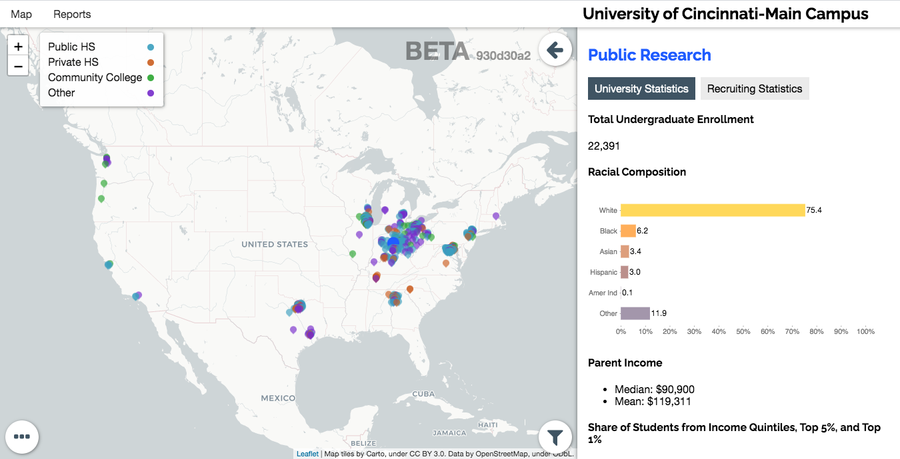

## Purpose of tool

- Display key information and metrics for state, university, and local-level stakeholders
- Track current efforts toward diversity and opportunities for change and improvement
- Serve as part of an advocacy and accountability tool

## Proposed deliverable

- An interactive, online tool to accomplish the goals identified above
- Mobile-friendly design for easy accessibility across all platforms and devices
- Includes an interactive map component as well as other graphical and numeric displays

#### Universities to include

- University of Illinois at Urbana-Champaign
- Ohio State University

#### Data to include

- **Characteristics of high schools**
  - *NCES Common Core of Data (CCD)* for public HS data
  - *NCES Private School Universe Survey (PSS)* for private HS data
- **Characteristics of community**
  - *Census American Community Survey (ACS)* for state, zip code, tract-level data
- **Access to the university**
  - *Integrated Postsecondary Education Data System (IPEDS)* for university data
    - Enrollment composition of university (e.g., race/SES)
  - Access by high school or community (e.g., zip code, district)
    - E.g., # of students from each HS/community by race/ethnicity category
    - Can try to obtain data from state, higher ed board, or university
- **Recruiting behavior**
  - Off-campus recruiting events (visited vs. nonvisited)
  - Student list purchases (targeted vs. not targeted)
- **Digital marketing/advertising**
  - Money spent on advertising
  - Geographic targeting of advertising
  - Analysis of images/text in advertising
- **Other**
  - Surveys and questionnaire results
    - Information about campus climate (inside and outside of the classroom)
  - External links and resources
    - Information regarding the Diversity, Equity, and Inclusion Policies of the university
    - Information regarding the university's partnerships and outreach to BIPOC communities

## Examples of similar tools we have created

#### Third Way interactive map

- Map shows recruiting events by a specific university at a specific metro area (e.g., University of Cincinnati in Chicago metro area)
- Can select which types of events to display (public HS, private HS, community college, other)
  - Filled in point means visited location, unfilled point means nonvisited location
  - Click on point to view more info
- Zip codes in the metro area are colored according to some measure (income, population total, race/ethnicity), which can be toggled
  - Click on zip code to view more info

<iframe src="./assets/maps/map_small.html" width="100%" style="border:none; height:600px;"></iframe>

_Source: [Third Way report](https://www.thirdway.org/report/follow-the-money-recruiting-and-the-enrollment-priorities-of-public-research-universities)_

#### EMRA interactive map

- Select university to see their off-campus recruiting events
  - Sidebar will display both university and recruiting statistics
- Then, can select specific location visited by the university on map (e.g., HS, community college)
  - Sidebar will display some stats about that visited location
  - Can further select nearby visited or nonvisited school to compare to

_Source: [EMRA interactive map](https://map.emraresearch.org/)_
