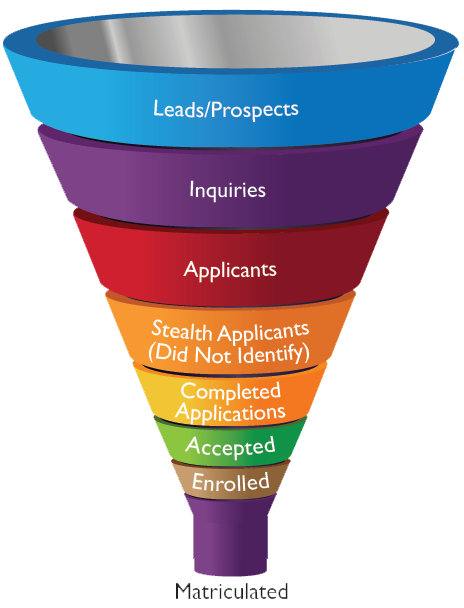

# Introduction

Socioeconomic and racial inequality in access to public research universities is a growing concern for scholars and policy advocates [@RN4409]. 

text text text

# Background

## Enrollment Management

While policy debates about access to higher education often focus on student behavior, universities are purposeful about which students they pursue and expend substantial resources crafting their class. Understanding the relationship between university enrollment behaviors and access inequality requires a basic understanding of the "enrollment management" industry. 

Enrollment management (EM) is a profession that integrates techniques from marketing and economics in order to "influence the characteristics and the size of enrolled student bodies" [@RN2771, p. xiv].  EM is also a university administrative structure (e.g., "The Office of Enrollment Management") that coordinates the activities of offices responsible for admissions, financial aid, marketing, and recruiting. 

The broader enrollment management industry consists of professionals working within universities (e.g., admissions counselors), the associations enrollment management professionals belong to (e.g., National Association for College Admission Counseling), and the marketing/enrollment management consultancies universities hire (e.g., Hobsons, Ruffalo Noel Levitz).

Figure 2 depicts the "enrollment funnel," a conceptual tool the EM industry uses to describe stages in student recruitment in order to inform targeted recruiting interventions. The vast majority of research on enrollment management focuses on the final stages of the enrollment funnel, specifically which applicants are admitted [e.g., @RN3536; @RN3544; @RN3523; @RN4131] and the use of financial aid "leveraging" to convert admits to enrollees [e.g., @RN2241; @RN3564; @RN1948]. By contrast, the enrollment management industry expends substantial resources on earlier stages in the funnel.  "Prospects" are "all the potential students you would want to attract to your institution" [@RN4322]. "Inquiries" are prospects that contact the university, including those who respond to university solicitations (e.g., email, brochure) and those who reach out on their own (e.g., sending SAT/ACT scores to a university, completing a form on the admissions website).  

Universities identify prospects primarily by purchasing ``student lists'' from College Board and ACT. For example, from 2010 to 2018, the University of Alabama paid \$1.9 million to College Board and \$349k to ACT, Inc [@RN4035]. Student lists contain contact details and background information (demographic, socioeconomic, and academic) about individual prospects. Universities control which prospects are included in the list by selecting on criteria such as zip code, race, and academic achievement. @RN4314 found that the median public university purchases about 64,000 names. 

Once identified, prospects are targeted with recruiting interventions aimed at soliciting inquiries and applications [@RN4323; @RN4402]. Face-to-face interventions include off-campus visits by universities admissions representatives (e.g., to a local high school) and on-campus visits by prospects. Non face-to-face interventions include email, mail (e.g., postcards, brochures), and texts.  Additionally, universities utilize paid advertising (e.g., pay-per-click ads from Google, cookie-driven ads that target prospects who visit your website) and social media (e.g., Twitter, Instagram, YouTube) as a means of generating inquiries and creating positive "buzz" amongst prospects. Given the the rise in "stealth applicants" who do not inquire before applying [@RN4411], social media enables universities to tell their story to prospects who do not contact the university and do not wish to be contacted.

The "data science" revolution in market research has given birth to a niche industry of higher education enrollment management/marketing consulting firms. These firms help universities identify prospects (e.g., which criteria to select when purchasing student lists) and decide which prospects should receive which recruiting interventions.  For example, from 2010 to 2018 the University of Alabama paid \$4.4 million to the EM consulting firm Hobsons [@RN4035] (2018 CPI). These firms make recommendations based on analytic tools that integrate university data (e.g., historical data on applicants, IP addresses that visit the university website), publicly available data, and proprietary data in order to predict application and enrollment priorities for each prospect and to predict the effect of recruiting interventions on these probabilities.  For example, one enrollment management consultant we spoke to said they know the houshold income, house value, and detailed expenditures (e.g., annual expenditure on hockey equipment) of every household in the US. 

## Off-Campus Recruiting

# Research and Findings

## Data and Methods

## Results

### Overall Patterns

### Income

### Race

# Policy Implications

# Conclusion

# References
